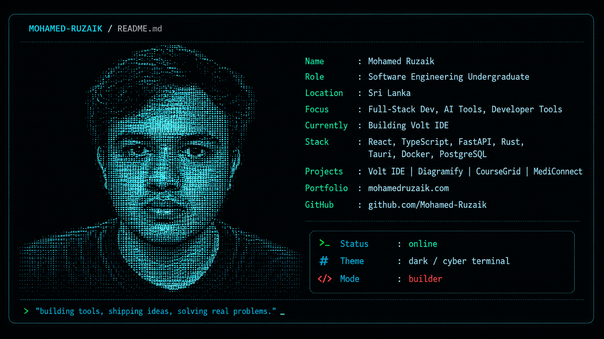

<div align="center">



# Hi, I'm Mohamed Ruzaik 👋

### Software Engineering Undergraduate · Full-Stack Developer · Developer Tool Builder

[Portfolio](https://mohamedruzaik.com) ·
[GitHub](https://github.com/Mohamed-Ruzaik)

</div>

---

## `> whoami`

```yaml
name: Mohamed Ruzaik
role: Software Engineering Undergraduate
location: Sri Lanka

focus:
  - Full-Stack Development
  - AI Tools
  - Developer Tools
  - Desktop Applications

currently_building: VoltCode
```

## `> tech --stack`

```text
Frontend    : React, TypeScript, JavaScript
Backend     : FastAPI, Python, Node.js
Desktop     : Tauri, Rust
Database    : PostgreSQL, Supabase
DevOps      : Docker, GitHub Actions
Tools       : Git, GitHub, VS Code, Linux
```

## `> projects --featured`

| Project | Description | Stack |
|---|---|---|
| **VoltCode** | Lightweight desktop code editor and mini IDE shell | Tauri, React, TypeScript |
| **Diagramify** | PlantUML diagram editor with authentication and cloud deployment | React, TypeScript, AWS |
| **CourseGrid LMS** | Full-stack learning management platform with roles, quizzes and grades | React, FastAPI, PostgreSQL |
| **MediConnect** | Healthcare platform connecting patients, doctors, hospitals and pharmacies | FastAPI, React, PostgreSQL |

## `> currently --learning`

```text
AI-assisted developer workflows
Desktop application architecture
DevOps and deployment automation
System design and scalable backend development
```

## `> github --activity`

My public repositories, contributions and current projects are available on my
[GitHub profile](https://github.com/Mohamed-Ruzaik).

## `> contact --open`

```text
Portfolio : mohamedruzaik.com
GitHub    : github.com/Mohamed-Ruzaik
Status    : building, learning, shipping
```

---

<div align="center">

```text
"Building tools, shipping ideas, solving real problems."
```

</div>
